# Find the Join Now Botton easily
1. Go on my webpage.
2. Go on the Navigation Bar.
3. The join Now Botton is easily found at the end of the Navbar in desktop,tablet and smartphone view.
4. When hovering the botton will change color on desktop.

## Desktop view 

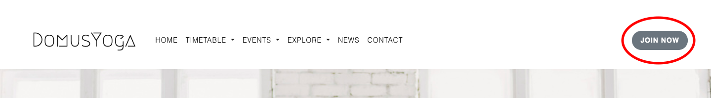

## Tablet & Smartphone view 

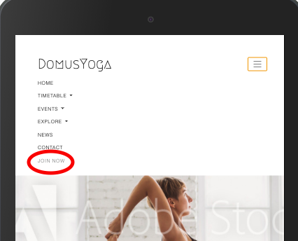

# Find special Offer
1. Go on my homepage.
2. Scrolling the homepage the first thing that the user will see it's special offer for him.
3. By cliccing on "Sign Up" the user will be able to quickly subscribe for thw offer.

# Visual Markers

## Visual Markers - Hover Transiction
1. Go on my homepage.
2. Click on the icons in the 2nd section.
3. When hover on the icons, these will slightly grow.

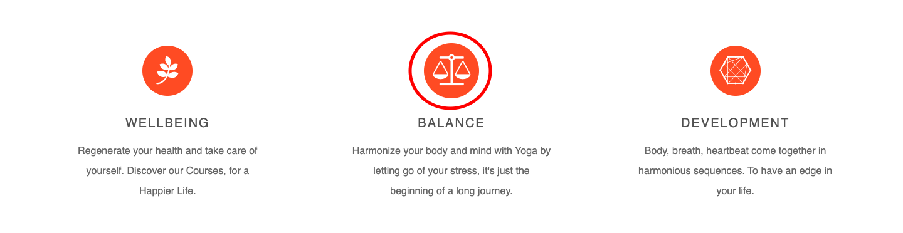

## Visual Markers - Hover Selector

### Join Now botton
1. Go on the webpage.
2. Click on "Join Now".
3. When hoven on the botton the color change from white to grey.

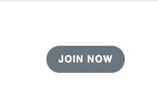

### Book Botton
1. Go on the timetable page.
2. Click on "Book" in the timetable.
3. When hover on the botton the color change from white to grey.

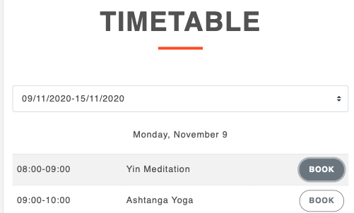

### Orange Bottons
1. Go through the homepage, timetable and contact page.
2. Click on the orange bottons.
3. When hover on these bottons the color change from orange to dark orange.
##### Will use as example the Sign Up botton on the homepage

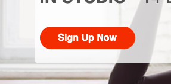 

### Contact Page - Icons
1. Go on the contact page.
2. Click on the icons in the "contact info" secition.
3. When hover on these icons the color change from orange to dark orange.

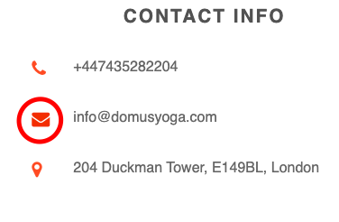

### Footer - Classes, Contact, Newsletter, Social.
1. Go on the footer of the webpage.
2. Click on the option under "Classes"; Click on the Contact Icons; Click on the Icon next to The newsletter form; Click on the social links.
3. When hover on these elements the color chage from white to grey.

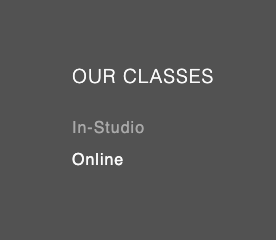 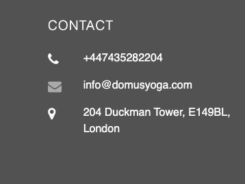 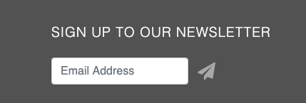 

# Key Benefits
1. Go on the homepage.
2. Scroll the homepage.
3. In the 2nd section the user will find the benefits of purchasing the product.

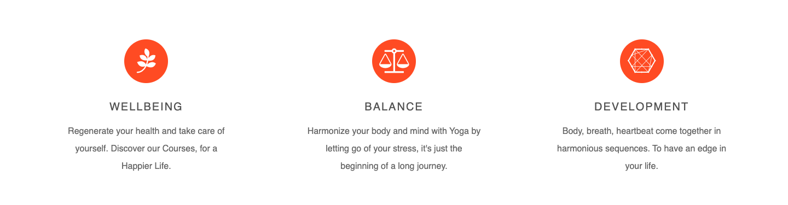

# Inclusivity
1. Go on the homepage.
2. Scroll down the homepage.
3. In the 3rd section the user will be reassured that DY is for everyone.

# Flexibility
1. Go on the homepage.
2. Scroll down the homepage.
3. On the 4th section the user will receive the information that the course at DY are flexible. Course can be followed online, anytime and from anywhere to fit the user lifestyle.

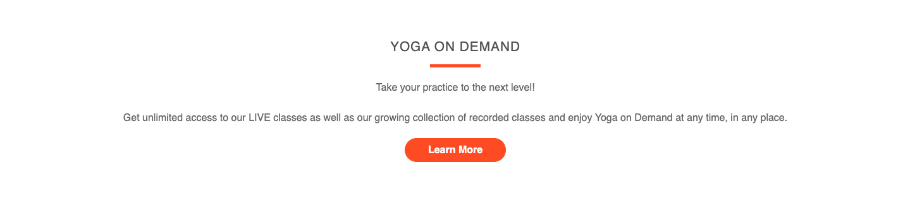

# Trasparency
1. Go on the homepage.
2. Scroll down the homepage.
3. On the 5th section the user will be able to find out more about the people behing the brand, with the opportunity to know them and their skills in advance developing in this way trust towards the brand.

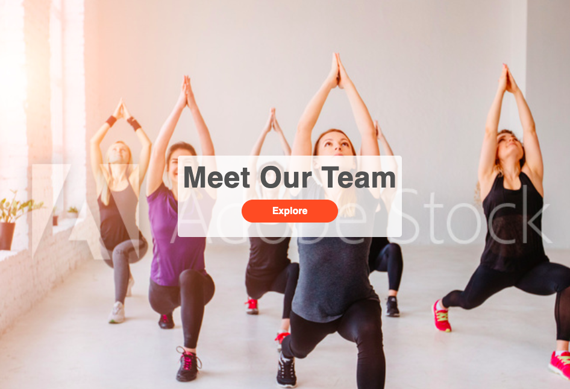

# Contact Form 
1. Go to the contact page.
2. Fill in all input fields with valid information.
3. Leave no input field empty, if a field is empty and the send button is clicked, a validation pop-up will appear prompting you to fill in the field. 
4. At the bottom of the contact form there is a radio botton that will allow the user to subscribe to the newsletter, if the user wish to.
5. Once all input fields are filled in, press the send button. 
6. Once the send button is clicked, it will inform the user that the message has been sent successfully.

### Step 2
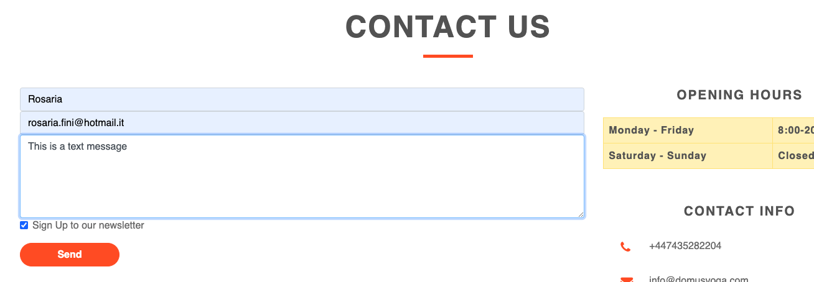
### Step 3
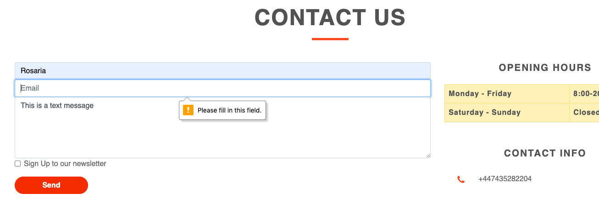

# Easy Booking Process
1. Go to the timetable page.
2. Scroll down the page to find the classes timetable.
3. Click the botton "Book" and it will direct the user to the link to complete the booking. 

# Newsletter
1. Go to the footer of the webpage.
2. Go to the "Sign Up To Our Newsletter" section.
3. Fill up the form with a valid email.
4. If the email is invalid and the paper plan icon is clicked, a validation pop-up will appear prompting you to fill the field.
5. Once the field is filled in, press the paper plane icon.
6. Once the paper plan icon is clicked, it will infotm the user that the email has been sent successfully.

### Step 3
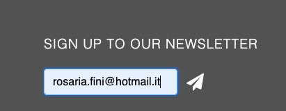
### Step 4
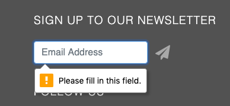

# Social links
1. Go to the footer of the webpage.
2. Go to the "Follow us" section.
3. In this section the user will find out about the DY social links.

